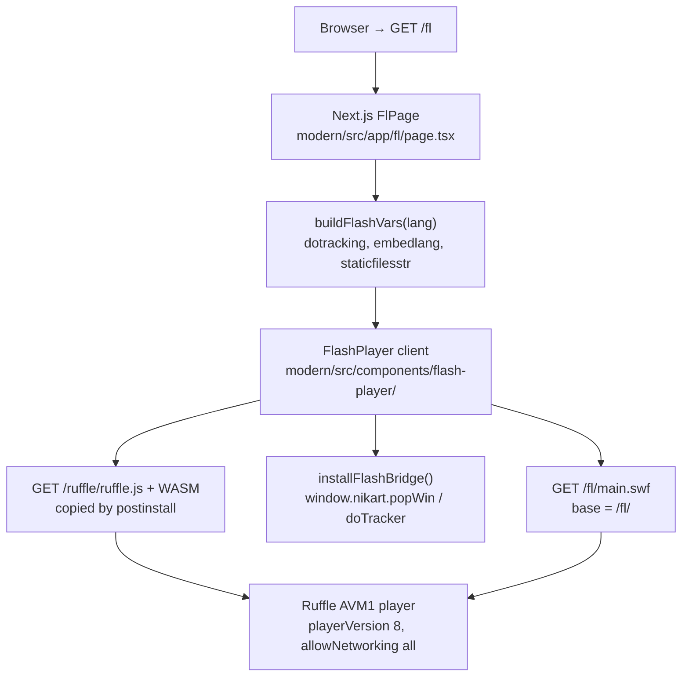
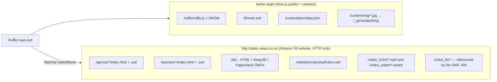
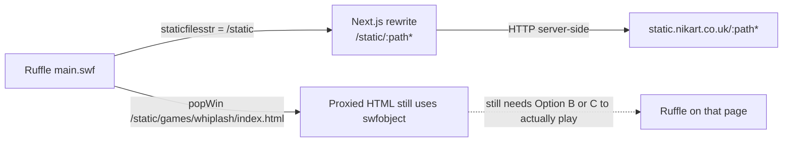
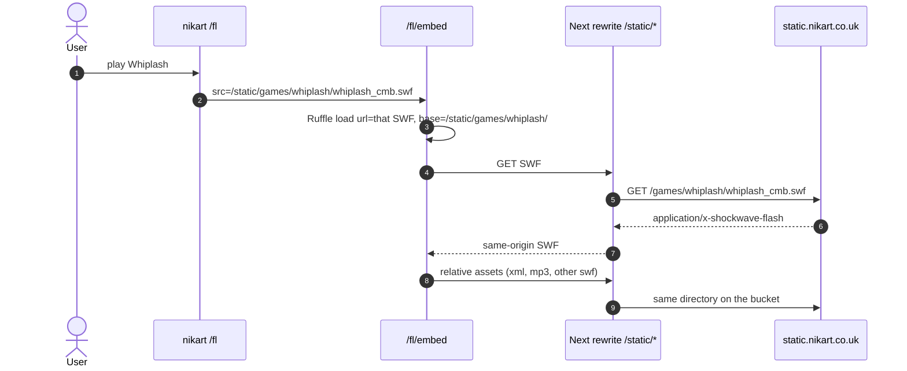
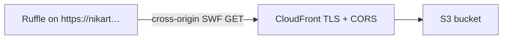
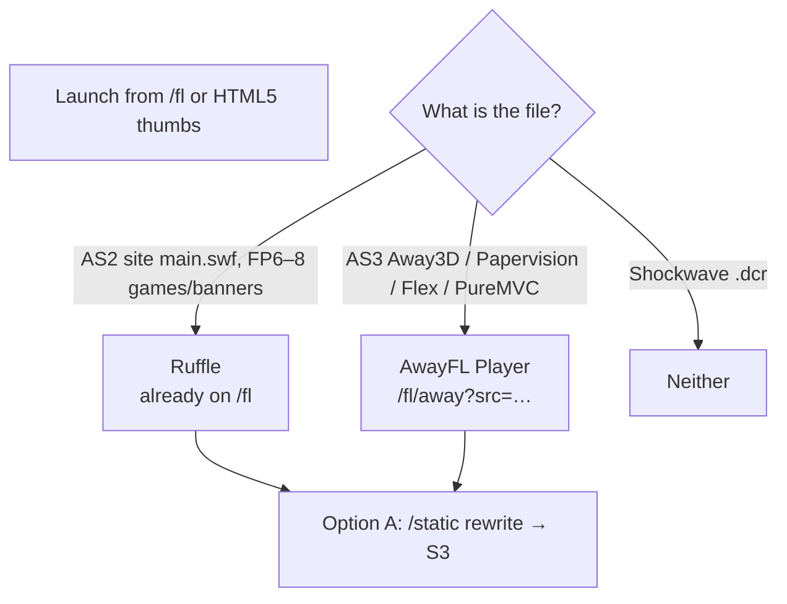

# Ruffle preview architecture

How the modern app currently plays the archival Flash site at `/fl`, and options for playing the Flash pieces that still live on `http://static.nikart.co.uk`.

---

## Current preview (`/fl`)

The modern app does **not** load the portfolio SWF from the static host. Ruffle runs **same-origin**: Next.js serves `ruffle.js`, `main.swf`, JSON, and images. The static host is only the `staticfilesstr` flashVar (production) used by the SWF for pop-up launches and FLV video.




### Runtime sequence

```mermaid
sequenceDiagram
  autonumber
  actor User
  participant Page as FlPage /fl
  participant FP as FlashPlayer
  participant Ruffle as Ruffle WASM
  participant Origin as Next.js same-origin
  participant S3 as static.nikart.co.uk HTTP S3

  User->>Page: GET /fl?lang=en|es
  Page->>Page: resolveFlashLangCode (query or NEXT_LOCALE cookie)
  Page->>FP: FlashPlayer(swfUrl=/fl/main.swf, flashVars)
  FP->>FP: installFlashBridge() → window.nikart
  FP->>Origin: GET /ruffle/ruffle.js
  Origin-->>FP: ruffle.js + core.ruffle.*.js + .wasm
  FP->>Ruffle: createPlayer(); load({url, base, parameters})
  Ruffle->>Origin: GET /fl/main.swf
  Origin-->>Ruffle: AS2 SWF (CWS, player 8)
  Ruffle->>Origin: LoadVars ../content/json/data.json
  Note over Origin: Resolves via base=/fl/ → /content/json/data.json
  Origin-->>Ruffle: portfolio JSON tree
  Ruffle->>Origin: loadMovie ../content/img/{id}.jpg
  Note over Origin: /content/img/* rewritten to /_generated/img/*
  Origin-->>Ruffle: JPEG thumbs / slides

  alt production NODE_ENV
    Note over Ruffle,S3: staticfilesstr = http://static.nikart.co.uk
    Ruffle->>S3: NetStream pathStatic/video_flv/{id}
    Note over S3: video_flv keys are 404 today; H.264/WebM still exist
    Ruffle->>FP: javascript:nikart.popWin(pathStatic + relative url)
    FP->>S3: popup games/ 3d/ banners/ websites/ HTML+SWF
  else development NODE_ENV
    Note over Ruffle,Origin: staticfilesstr = ../static → /static (not served; public/static gitignored)
  end
```

### What is same-origin vs what is on S3



### Key implementation facts

| Piece | Where | Role |
|-------|--------|------|
| Route | `modern/src/app/fl/page.tsx` | 750×500 black stage, outside locale middleware |
| Lang | `?lang=` or `NEXT_LOCALE`; `/fl/[lang]` sets cookie and redirects | Same flashVar `embedlang` as legacy |
| Player | `modern/src/components/flash-player/flash-player.tsx` | Loads self-hosted Ruffle, `base` = directory of the SWF |
| flashVars | `modern/src/lib/flash-config.ts` | `dotracking=yes`, `embedlang`, `staticfilesstr` |
| JS bridge | `modern/src/lib/flash-bridge.ts` | `javascript:nikart.popWin` / `doTracker` from the SWF |
| Runtime | `modern/public/ruffle/` (gitignored) | Copied from `@ruffle-rs/ruffle` in `postinstall` |
| SWF | `modern/public/fl/main.swf` | AS2 (AVM1), zlib `CWS`, Flash 8 |
| Data | `modern/public/content/json/data.json` | SWF path `../content/json/data.json` via Ruffle `base` |
| Images | `/content/img` rewrite | Same tree the HTML5 site uses |
| Static host | `http://static.nikart.co.uk` | S3 website; **no CORS headers**; **HTTP only** |

Inside `main.swf` (decompressed strings): `pathContent = ../content`, `pathStatic = _root.staticfilesstr \|\| ../static`, `pathJSON = /json/data.json`, `pathImg`, `pathVideo = /video_flv`, plus `javascript:nikart.popWin(` and `javascript:nikart.doTracker(`.

HTML5 already proxies some of that host through Next (`/video_h264`, `/video_webm`, `/games` in `modern/next.config.ts`). The Flash player does **not** use those rewrites: it is given the raw `staticfilesstr` URL.

### What actually previews today

- **Works (same-origin):** lizard UI, menus, thumbs, article/image slideshows, language toggle, HTML5/Flash view links that stay on this origin (`_self/`).
- **Pop-ups to S3:** games, banners, 3D, some websites. Those HTML wrappers still call `swfobject.embedSWF(...)`. Without Ruffle on that page (and without HTTPS), they show “You need Flash Player”.
- **Flash video:** SWF asks for `{staticfilesstr}/video_flv/{id}`. Those keys 404. H.264/WebM files **do** exist on the same bucket (`/video_h264/spark.mp4`, `/video_webm/spark.webm`) and are what the HTML5 `VideoView` uses.
- **HTTPS mixed content:** a Vercel preview is HTTPS. A flashVar of `http://static.nikart.co.uk` is blocked as mixed content for XHR/NetStream, and pop-ups land on an HTTP S3 site.

---

## Potential ways to show Flash from `static.nikart.co.uk`

The bucket still has playable SWFs (probed 2026-09-15). Examples:

| Kind | Wrapper | SWF |
|------|---------|-----|
| Game | `/games/whiplash/index.html` | `whiplash_cmb.swf` (200, Flash 6) |
| Game | `/games/ciudad_helm/index.html` | swfobject + SCORM JS |
| Banner | `/banners/standardlife/index.html` | `standardlife.swf` (Flash 9) |
| Banner | `/banners/hellboy/index.html` | `hb_expanded_lb.swf` |
| Site | `/websites/claro/index.html` | `swf/claro.swf` (Flash 9) |
| 3D | `/3d/away3d/ar_heart/turn-on-your-webcam.html` | `Main.swf` — AVM2 FP10, Away3D Lite + FLAR + Camera |
| 3D | `/3d/away3d/flar_lizard/pub/index.html` | `FLARLizard_ex.swf` — AVM2 FP10, Away3D + FLARToolkit + Flex UI |
| 3D | `/3d/papervision3d/spaceship/index.html` | `Spaceship.swf` — AVM2 FP9, Papervision3D (software rasterizer) |
| 3D | `/3d/shockwave3d/index.html` | `japanese.dcr` — **Director, not Flash** (neither Ruffle nor AwayFL) |
| Video (HTML5) | — | `/video_h264/*.mp4` (not FLV) |

Ruffle cannot load those files **directly from HTTP S3** on an HTTPS page: mixed content, and S3 sends no `Access-Control-Allow-Origin`.

### Option A — Same-origin reverse proxy (keep `main.swf` local)

Point `staticfilesstr` at `/static` (or keep `../static`) and rewrite that prefix to the bucket. Same pattern as today’s `/games` and `/video_h264` rewrites.




**Good for:** mixed-content fix, one origin, existing flashVars shape.  
**Not enough alone:** proxied `index.html` pages still expect a plugin; they do not load Ruffle.

### Option B — Dedicated Ruffle embed of a remote SWF

Add something like `/fl/embed?src=/static/games/whiplash/whiplash_cmb.swf`. Reuse `FlashPlayer` with `url` + `base` set to the **proxied** directory so relative loads stay on this origin.




**Good for:** one game/banner at a time, correct `base` for sibling assets.  
**Watch-outs:** each piece has its own Flash version (6 vs 9 vs 10), `allowScriptAccess`, and ExternalInterface (SCORM on Ciudad). Away3D / Papervision / FLAR are weak in Ruffle.

### Option C — Proxy the HTML wrapper and inject Ruffle

Leave the original `swfobject.embedSWF` pages as-is. Serve them through Next, inject `/ruffle/ruffle.js`. Ruffle’s polyfill replaces the plugin.


```mermaid
flowchart TB
  click["popWin /static/games/whiplash/index.html"]
  mw["Next middleware / rewrite"]
  html["S3 HTML + swfobject"]
  inject["Inject script src=/ruffle/ruffle.js"]
  polyfill["Ruffle polyfill upgrades embed/object"]
  swf["Relative whiplash_cmb.swf via same /static proxy"]

  click --> mw --> html --> inject --> polyfill --> swf
```

**Good for:** banners and games that already have HTML shells (Whiplash, Standard Life, Hellboy, Claro).  
**Watch-outs:** rewriting HTML on the fly; `allowscriptaccess` + SCORM; mixed-content if the wrapper still references `http://` third parties.

### Option D — HTTPS + CORS on the bucket (no Next proxy)

Put CloudFront (or S3 HTTPS) in front of `static.nikart.co.uk` with `Access-Control-Allow-Origin` for the app origin. Then Ruffle can `load({ url: "https://static.nikart.co.uk/games/whiplash/whiplash_cmb.swf", base: "..." })`.




**Good for:** keeping binaries off the Next app, sharing files with HTML5.  
**Requires:** DNS/TLS/CORS on infrastructure you do not currently configure in this repo. Ruffle still needs a page that constructs the player (Options B or C).

### Option E — Mirror selected SWFs into `public/static`

Copy the pieces you care about into the app (legacy already gitignores `public/static`). `staticfilesstr = ../static` then matches local files with no S3 at runtime.

**Good for:** offline / archival demos.  
**Cost:** large binaries in git or a release artifact; stale copies.

### Option F — AwayFL for S3 AS3 / Away3D (keep Ruffle on `/fl`)

[AwayFL](https://github.com/awayfl/awayfl-player) is a TypeScript Flash emulator (FP 6+, AVM1 and AVM2) whose renderer is [AwayJS](https://github.com/awayjs) — the WebGL port of **Away3D**, the same engine used in the heart and lizard pieces. Coolmath Games ships production titles on it. Embed paths: intercept `swfobject` (`awayfl-embed`), or `new AWAYFL.Player(); player.loadBuffer(arrayBuffer)`.

It is **not** a swap for the current `/fl` player. `main.swf` is AS2 / Flash 8 and already runs in Ruffle. AwayFL’s advantage is the **S3 AS3 catalog**, especially software-rendered 3D.




#### Why AwayFL matches this bucket

AwayFL did not start as a general SWF polyfill. Away Studios ported Away3D to JavaScript (AwayJS), then taught that renderer to execute SWF bytecode. That lineage is the opposite of Ruffle (Rust WASM, display-list first, Stage3D still catching up).

Probed 2026-09-15:

| File | Runtime | AwayFL angle | Ruffle angle |
|------|---------|--------------|--------------|
| `/fl/main.swf` (local) | AS2 FP8 | Can run; no reason to switch | **Already previewing** |
| `games/whiplash/whiplash_cmb.swf` | AS2 FP6 | Possible | Prefer Ruffle |
| `banners/standardlife/standardlife.swf` | AS3 FP9 PureMVC + TweenMax | Strong (Coolmath-style AVM2) | Try second |
| `websites/claro/swf/claro.swf` | AS3 FP9 Sprite | Strong | Try second |
| `3d/papervision3d/spaceship/Spaceship.swf` | AS3 FP9 Papervision3D | **Better shot** — software triangles via `flash.display`, not Stage3D GPU | Weak; PV3D is a heavy display-list 3D engine |
| `3d/away3d/ar_heart/Main.swf` | AS3 FP10 Away3D Lite + FLAR + Camera | **Best unique fit** for the 3D viewport (`away3dlite` → AwayJS). AR still needs Camera | Weak |
| `3d/away3d/flar_lizard/pub/FLARLizard_ex.swf` | AS3 FP10 Away3D + FLARToolkit + **Flex** UI | 3D engine friendly; Flex `mx.controls` + Camera are extra risk | Weak |
| `3d/shockwave3d/japanese.dcr` | Director | No | No |

#### What AwayFL does **not** magically fix

Running an Away3D SWF in AwayFL is **not** the same as rewriting it to AwayJS. The SWF still contains original AS3 (`away3d.*`, `away3dlite.*`, `org.papervision3d.*`). AwayFL’s AVM2 interprets that code against `playerglobal`; AwayJS only draws whatever `flash.display` / BitmapData those engines use.

- **FLAR / webcam:** both heart and lizard call `com.transmote.flar` + `FLARCameraSource` (`flash.media.Camera`). Mapping Camera to `getUserMedia` is incomplete in both emulators. Realistic preview is the **3D mesh without live tracking**, or the lizard’s built-in `FLARProxy` (mouse-as-marker) if that path is reachable.
- **Flex:** `FLARLizard_ex.swf` is a Flex `SystemManager` app (`mx.controls.RadioButton`, etc.). AwayFL is game-oriented; Flex chrome often breaks first.
- **Papervision ≠ Away3D:** Spaceship still has to emulate PV3D’s software rasterizer. AwayFL may do better than Ruffle because AVM2 + BitmapData is its home turf, not because it “is Papervision”.
- **Same HTTP/CORS wall as Ruffle:** AwayFL `fetch`es SWF bytes. Without Option A (or D), HTTPS nikart cannot load `http://static.nikart.co.uk`.
- **Integration cost:** `@awayfl/awayfl-player` is a webpack/runtime bundle (`runtime.js`), not a one-script drop-in like `@ruffle-rs/ruffle`. Plan a `public/awayfl/` copy similar to `public/ruffle/`, plus per-SWF `baseUrl` / `binary` config ([awayfl-embed](https://github.com/awayfl/awayfl-embed)).

```mermaid
sequenceDiagram
  autonumber
  actor User
  participant Site as nikart
  participant Away as /fl/away AwayFL
  participant Proxy as Next /static rewrite
  participant S3 as static.nikart.co.uk

  User->>Site: open Away3D heart or FLAR lizard
  Site->>Away: src=/static/3d/away3d/…/Main.swf
  Away->>Away: new AWAYFL.Player(); loadBuffer()
  Away->>Proxy: GET SWF + relative XML / patterns / textures
  Proxy->>S3: HTTP server-side
  S3-->>Proxy: AVM2 SWF (Away3D Lite / FLAR)
  Proxy-->>Away: same-origin bytes
  Note over Away: WebGL via AwayJS<br/>Camera/FLAR may no-op<br/>3D viewport is the win
```

### Option F — AwayFL popup (mocked)

`/fl/away` loads static wrapper HTML (or a `.swf`) through the `/static` rewrite, extracts the movie with the same parser for every piece, and plays it in AwayFL.

- `nikart.popWin` on `/fl` now opens that page instead of the raw S3 HTML for `games/`, `banners/`, `websites/`, and `3d/` (Shockwave `.dcr` is skipped).
- HTML5 article launch buttons for those URLs go to the same popup page.
- Default / Claro shortcut: `/fl/away?src=websites/claro/index.html&w=960&h=700`.
- Runtime is copied from `@awayfl/awayfl-player` to `public/awayfl/` in `postinstall` (gitignored). AVM2 ABC catalogs that npm omits are vendored in `modern/vendor/awayfl-builtins/`.
- Wrapper HTML with no embed (Away3D heart splash) still tries sibling `Main.swf`. `AC_FL_RunContent` (Papervision Spaceship) is parsed the same way as SWFObject.
- First-run notes: Claro’s SWF executes (client XML traces) but the stage stays white because AwayFL `TextField` / `LoaderInfo.parameters` are stubbed. Whiplash’s menu renders. Heart splash has no embed; the player then loads `Main.swf` beside it.

### Option F — side-by-side compare kit (temporary)

`/swf-compare/` copies S3 SWFs and sidecars into `modern/public/swf-compare/pieces/` (committed so Vercel preview can live-play them). Ruffle (`public/ruffle/`) and AwayFL (`public/awayfl/`) are also committed, because gitignored postinstall copies never reached the preview. Each SWF gets its own HTML page with generic Ruffle and AwayFL players (Ruffle `autoplay: "on"`, unmute overlay hidden). Portfolio launch buttons and `nikart.popWin` open that page in a full tab instead of the old popup. Refresh copies with `npm run swf-compare:sync --prefix modern`.


---

## Recommendation

The AwayFL popup (`/fl/away`) is mocked: `popWin` and HTML5 launch buttons for S3 Flash wrappers open that page through the `/static` rewrite. Remaining work to preview S3 Flash from `/fl` without mixed content:

1. **Option A** so `staticfilesstr` (and AwayFL fetches) are same-origin.
2. **Split players:** Ruffle for `main.swf` + AVM1; **Option F (AwayFL)** for Away3D / Papervision / stubborn AS3; Ruffle Option B/C for the rest.
3. Treat FLAR webcam as a stretch goal (Camera API). Aim first at the 3D models, using `FLARProxy` on the lizard if present.
4. Map Flash video to `/video_h264` (or restore `video_flv`) — the FLV prefix the SWF uses is empty on the bucket today.
5. Leave Shockwave 3D as an HTML/screenshot fallback.

Option D is complementary if you want a public HTTPS static CDN later.

---

## Related files

- `modern/src/app/fl/page.tsx` — archival route
- `modern/src/components/flash-player/flash-player.tsx` — Ruffle embed
- `modern/src/lib/flash-config.ts` — flashVars / static base
- `modern/src/lib/flash-bridge.ts` — `window.nikart`
- `modern/next.config.ts` — existing S3 rewrites for HTML5
- `app/views/fl.html` — legacy swfobject embed this route mirrors
- `modern/src/app/fl/away/` — AwayFL popup page
- `modern/src/components/awayfl-player/` — UMD loader + `playSWF`
- `modern/src/lib/awayfl-static.ts` — `/static` proxy + HTML→SWF parser
- `modern/scripts/copy-awayfl.mjs` — copies UMD + vendored ABC builtins
- [AwayFL player](https://github.com/awayfl/awayfl-player) / [embed](https://github.com/awayfl/awayfl-embed) — Option F runtime
