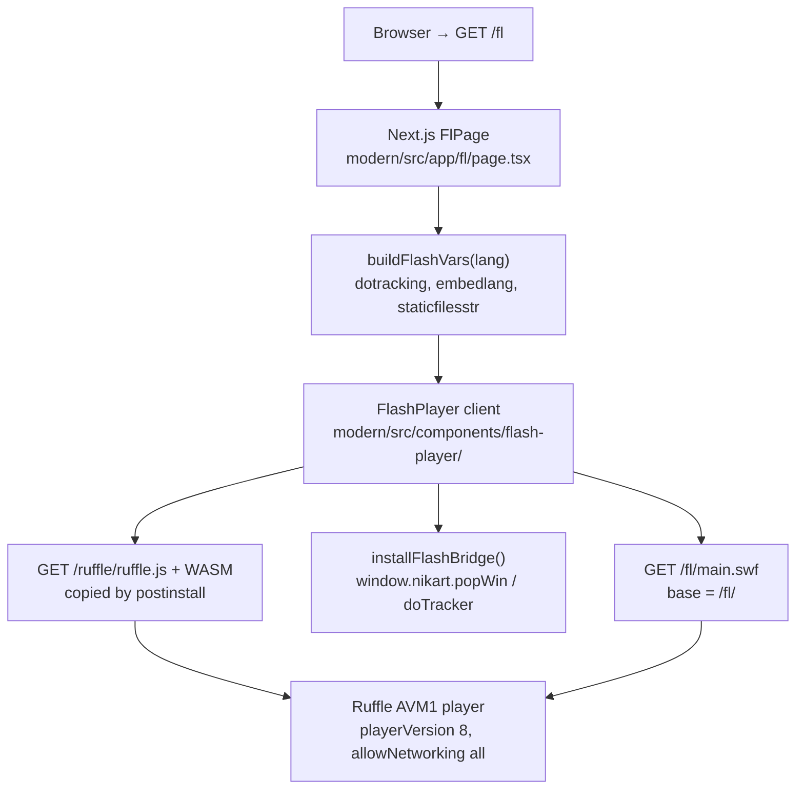
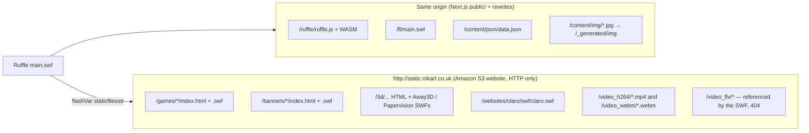
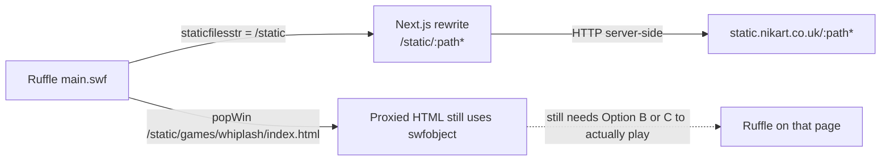
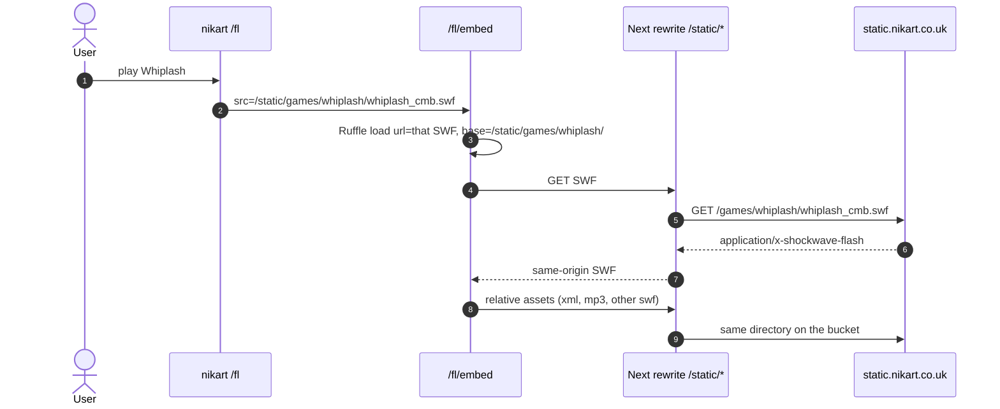
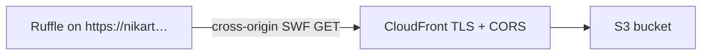

# Ruffle preview architecture

How the modern app currently plays the archival Flash site at `/fl`, and options for playing the Flash pieces that still live on `http://static.nikart.co.uk`.

---

## Current preview (`/fl`)

The modern app does **not** load the portfolio SWF from the static host. Ruffle runs **same-origin**: Next.js serves `ruffle.js`, `main.swf`, JSON, and images. The static host is only the `staticfilesstr` flashVar (production) used by the SWF for pop-up launches and FLV video.




### Runtime sequence

```mermaid
sequenceDiagram
  autonumber
  actor User
  participant Page as FlPage /fl
  participant FP as FlashPlayer
  participant Ruffle as Ruffle WASM
  participant Origin as Next.js same-origin
  participant S3 as static.nikart.co.uk HTTP S3

  User->>Page: GET /fl?lang=en|es
  Page->>Page: resolveFlashLangCode (query or NEXT_LOCALE cookie)
  Page->>FP: FlashPlayer(swfUrl=/fl/main.swf, flashVars)
  FP->>FP: installFlashBridge() → window.nikart
  FP->>Origin: GET /ruffle/ruffle.js
  Origin-->>FP: ruffle.js + core.ruffle.*.js + .wasm
  FP->>Ruffle: createPlayer(); load({url, base, parameters})
  Ruffle->>Origin: GET /fl/main.swf
  Origin-->>Ruffle: AS2 SWF (CWS, player 8)
  Ruffle->>Origin: LoadVars ../content/json/data.json
  Note over Origin: Resolves via base=/fl/ → /content/json/data.json
  Origin-->>Ruffle: portfolio JSON tree
  Ruffle->>Origin: loadMovie ../content/img/{id}.jpg
  Note over Origin: /content/img/* rewritten to /_generated/img/*
  Origin-->>Ruffle: JPEG thumbs / slides

  alt production NODE_ENV
    Note over Ruffle,S3: staticfilesstr = http://static.nikart.co.uk
    Ruffle->>S3: NetStream pathStatic/video_flv/{id}
    Note over S3: video_flv keys are 404 today; H.264/WebM still exist
    Ruffle->>FP: javascript:nikart.popWin(pathStatic + relative url)
    FP->>S3: popup games/ 3d/ banners/ websites/ HTML+SWF
  else development NODE_ENV
    Note over Ruffle,Origin: staticfilesstr = ../static → /static (not served; public/static gitignored)
  end
```

### What is same-origin vs what is on S3



### Key implementation facts

| Piece | Where | Role |
|-------|--------|------|
| Route | `modern/src/app/fl/page.tsx` | 750×500 black stage, outside locale middleware |
| Lang | `?lang=` or `NEXT_LOCALE`; `/fl/[lang]` sets cookie and redirects | Same flashVar `embedlang` as legacy |
| Player | `modern/src/components/flash-player/flash-player.tsx` | Loads self-hosted Ruffle, `base` = directory of the SWF |
| flashVars | `modern/src/lib/flash-config.ts` | `dotracking=yes`, `embedlang`, `staticfilesstr` |
| JS bridge | `modern/src/lib/flash-bridge.ts` | `javascript:nikart.popWin` / `doTracker` from the SWF |
| Runtime | `modern/public/ruffle/` (gitignored) | Copied from `@ruffle-rs/ruffle` in `postinstall` |
| SWF | `modern/public/fl/main.swf` | AS2 (AVM1), zlib `CWS`, Flash 8 |
| Data | `modern/public/content/json/data.json` | SWF path `../content/json/data.json` via Ruffle `base` |
| Images | `/content/img` rewrite | Same tree the HTML5 site uses |
| Static host | `http://static.nikart.co.uk` | S3 website; **no CORS headers**; **HTTP only** |

Inside `main.swf` (decompressed strings): `pathContent = ../content`, `pathStatic = _root.staticfilesstr \|\| ../static`, `pathJSON = /json/data.json`, `pathImg`, `pathVideo = /video_flv`, plus `javascript:nikart.popWin(` and `javascript:nikart.doTracker(`.

HTML5 already proxies some of that host through Next (`/video_h264`, `/video_webm`, `/games` in `modern/next.config.ts`). The Flash player does **not** use those rewrites: it is given the raw `staticfilesstr` URL.

### What actually previews today

- **Works (same-origin):** lizard UI, menus, thumbs, article/image slideshows, language toggle, HTML5/Flash view links that stay on this origin (`_self/`).
- **Pop-ups to S3:** games, banners, 3D, some websites. Those HTML wrappers still call `swfobject.embedSWF(...)`. Without Ruffle on that page (and without HTTPS), they show “You need Flash Player”.
- **Flash video:** SWF asks for `{staticfilesstr}/video_flv/{id}`. Those keys 404. H.264/WebM files **do** exist on the same bucket (`/video_h264/spark.mp4`, `/video_webm/spark.webm`) and are what the HTML5 `VideoView` uses.
- **HTTPS mixed content:** a Vercel preview is HTTPS. A flashVar of `http://static.nikart.co.uk` is blocked as mixed content for XHR/NetStream, and pop-ups land on an HTTP S3 site.

---

## Potential ways to show Flash from `static.nikart.co.uk`

The bucket still has playable SWFs (probed 2026-09-15). Examples:

| Kind | Wrapper | SWF |
|------|---------|-----|
| Game | `/games/whiplash/index.html` | `whiplash_cmb.swf` (200, Flash 6) |
| Game | `/games/ciudad_helm/index.html` | swfobject + SCORM JS |
| Banner | `/banners/standardlife/index.html` | `standardlife.swf` (Flash 9) |
| Banner | `/banners/hellboy/index.html` | `hb_expanded_lb.swf` |
| Site | `/websites/claro/index.html` | `swf/claro.swf` (Flash 9) |
| 3D | `/3d/away3d/ar_heart/index.html` | HTML + later SWF/AR stages |
| Video (HTML5) | — | `/video_h264/*.mp4` (not FLV) |

Ruffle cannot load those files **directly from HTTP S3** on an HTTPS page: mixed content, and S3 sends no `Access-Control-Allow-Origin`.

### Option A — Same-origin reverse proxy (keep `main.swf` local)

Point `staticfilesstr` at `/static` (or keep `../static`) and rewrite that prefix to the bucket. Same pattern as today’s `/games` and `/video_h264` rewrites.




**Good for:** mixed-content fix, one origin, existing flashVars shape.  
**Not enough alone:** proxied `index.html` pages still expect a plugin; they do not load Ruffle.

### Option B — Dedicated Ruffle embed of a remote SWF

Add something like `/fl/embed?src=/static/games/whiplash/whiplash_cmb.swf`. Reuse `FlashPlayer` with `url` + `base` set to the **proxied** directory so relative loads stay on this origin.




**Good for:** one game/banner at a time, correct `base` for sibling assets.  
**Watch-outs:** each piece has its own Flash version (6 vs 9 vs 10), `allowScriptAccess`, and ExternalInterface (SCORM on Ciudad). Away3D / Papervision / FLAR are weak in Ruffle.

### Option C — Proxy the HTML wrapper and inject Ruffle

Leave the original `swfobject.embedSWF` pages as-is. Serve them through Next, inject `/ruffle/ruffle.js`. Ruffle’s polyfill replaces the plugin.


```mermaid
flowchart TB
  click["popWin /static/games/whiplash/index.html"]
  mw["Next middleware / rewrite"]
  html["S3 HTML + swfobject"]
  inject["Inject script src=/ruffle/ruffle.js"]
  polyfill["Ruffle polyfill upgrades embed/object"]
  swf["Relative whiplash_cmb.swf via same /static proxy"]

  click --> mw --> html --> inject --> polyfill --> swf
```

**Good for:** banners and games that already have HTML shells (Whiplash, Standard Life, Hellboy, Claro).  
**Watch-outs:** rewriting HTML on the fly; `allowscriptaccess` + SCORM; mixed-content if the wrapper still references `http://` third parties.

### Option D — HTTPS + CORS on the bucket (no Next proxy)

Put CloudFront (or S3 HTTPS) in front of `static.nikart.co.uk` with `Access-Control-Allow-Origin` for the app origin. Then Ruffle can `load({ url: "https://static.nikart.co.uk/games/whiplash/whiplash_cmb.swf", base: "..." })`.




**Good for:** keeping binaries off the Next app, sharing files with HTML5.  
**Requires:** DNS/TLS/CORS on infrastructure you do not currently configure in this repo. Ruffle still needs a page that constructs the player (Options B or C).

### Option E — Mirror selected SWFs into `public/static`

Copy the pieces you care about into the app (legacy already gitignores `public/static`). `staticfilesstr = ../static` then matches local files with no S3 at runtime.

**Good for:** offline / archival demos.  
**Cost:** large binaries in git or a release artifact; stale copies.

---

## Recommendation (not implemented)

To **preview S3 Flash content** from `/fl` without mixed content:

1. **Option A** so `staticfilesstr` is same-origin.
2. **Option B or C** so those SWFs actually run in Ruffle instead of a dead `swfobject` page.
3. Map Flash video to `/video_h264` (or restore `video_flv`) — the FLV prefix the SWF uses is empty on the bucket today.

Option D is complementary if you want a public HTTPS static CDN later.

---

## Related files

- `modern/src/app/fl/page.tsx` — archival route
- `modern/src/components/flash-player/flash-player.tsx` — Ruffle embed
- `modern/src/lib/flash-config.ts` — flashVars / static base
- `modern/src/lib/flash-bridge.ts` — `window.nikart`
- `modern/next.config.ts` — existing S3 rewrites for HTML5
- `app/views/fl.html` — legacy swfobject embed this route mirrors
